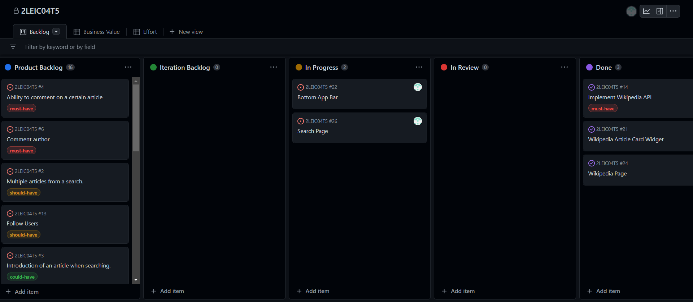
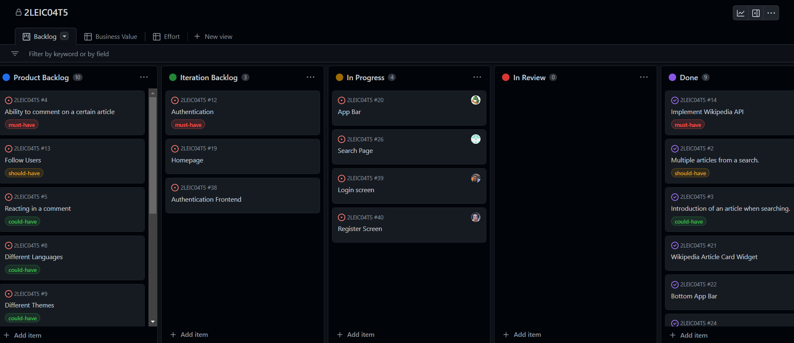
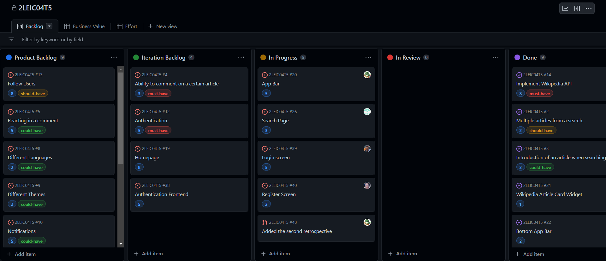

# Project management

## [Sprint 0](https://github.com/FEUP-LEIC-ES-2022-23/2LEIC04T5/releases/tag/iteration-0.1):

## Retrospective  

The first iteration was in line with our expectations. We felt that we did better in areas in which we thought the performance would be worse, but had disappointing results in some areas we felt confident about.

### WHAT WENT WELL

- The vertical slice of our application ended up exceeding our expectations; we were very happy with the version we delivered in iteration 0.
- We feel confident the structure of our logical architecture diagram was well conceived.
- Although not perfect, our product vision did a good job in describing the overarching long-term goal of our product.
- We worked well as a team and were able to tackle the challenges through constant communication and teamwork.

### WHAT WENT WRONG

- We overlooked some aspects of the project board organization, due to lack of research on how it should look upon the first iteration delivery.
- We failed to allocate enough resources to the development of the UI mockups.
- Both the domain model and physical architecture diagrams didn't get the attention they should have had.

### WHAT TO DO NEXT

- Improve our knowledge of Flutter and Dart.
- Redesign the physical architecture and domain model diagrams.
- Review the existing user stories and acceptance tests.
- Take a second look at all the things we got right and see if we can improve them even further.
- Continue developing the app so that we can have a better, more complete product when the second iteration delivery comes around.

Despite the issues we faced, we rised to the occasion and were able to deliver our first iteration succesfully; although far from perfect, we feel like we've created a solid basis for upcoming releases.

## [Sprint 1](https://github.com/FEUP-LEIC-ES-2022-23/2LEIC04T5/releases/tag/iteration-1.1):

## Retrospective

The second iteration yielded positive results, although we clearly misjudged the amount of work we could do during this sprint.

### WHAT WENT WELL

- We were very happy with the quality of this iteration's delivery.
- We managed to improve upon our physical architecture diagram and product vision.
- Once again, we worked well as a team and we managed to solve the problems that arised, through constant communication and teamwork.

### WHAT WENT WRONG

- We didn't fix everything that was wrong with the first iteration of our application.
- We overestimated the amount of work we could get done in this sprint and failed to implement a more detailed changelog.
- We failed to associate some specific tasks to a user story.

### WHAT TO DO NEXT

- Redesign the UML domain model diagram.
- Continue reviewing and improving the existing user stories and acceptance tests.
- Create user stories for the issues/tasks that are missing one.
- Improve our iterations' changelogs and plan the next iteration more carefully.
- Take a better look at all the things we got right and try to improve upon them.
- Continue developing our app so that we have an improved product when the third iteration delivery comes around.

Even though we could have planned this iteration a little more carefully, we think we overall did a good work with this iteration and we look forward to continue working on our project.

## [Sprint 2]():

## Retrospective

