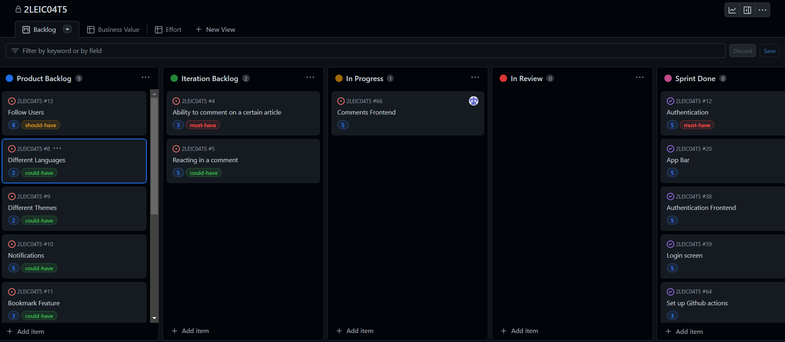
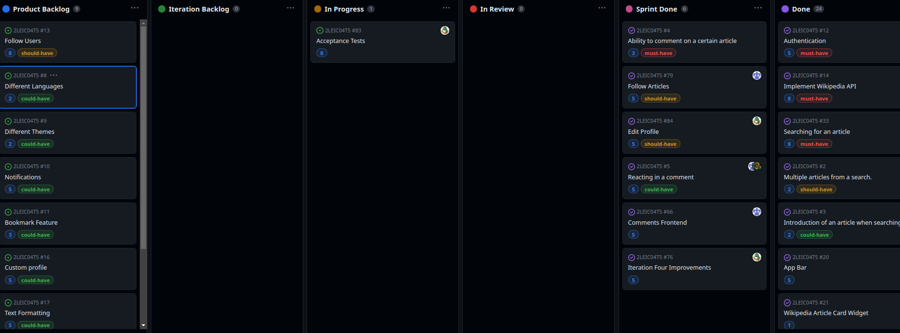

# Project management

## [Sprint 0](https://github.com/FEUP-LEIC-ES-2022-23/2LEIC04T5/releases/tag/iteration-0.1):

## Retrospective  

The first iteration was in line with our expectations. We felt that we did better in areas in which we thought the performance would be worse, but had disappointing results in some areas we felt confident about.

### WHAT WENT WELL

- The vertical slice of our application ended up exceeding our expectations; we were very happy with the version we delivered in iteration 0.
- We feel confident the structure of our logical architecture diagram was well conceived.
- Although not perfect, our product vision did a good job in describing the overarching long-term goal of our product.
- We worked well as a team and were able to tackle the challenges through constant communication and teamwork.

### WHAT WENT WRONG

- We overlooked some aspects of the project board organization, due to lack of research on how it should look upon the first iteration delivery.
- We failed to allocate enough resources to the development of the UI mockups.
- Both the domain model and physical architecture diagrams didn't get the attention they should have had.

### WHAT TO DO NEXT

- Improve our knowledge of Flutter and Dart.
- Redesign the physical architecture and domain model diagrams.
- Review the existing user stories and acceptance tests.
- Take a second look at all the things we got right and see if we can improve them even further.
- Appropriate Home Page with Trending Pages and Following Pages.
- Continue developing the app so that we can have a better, more complete product when the second iteration delivery comes around.

Despite the issues we faced, we rised to the occasion and were able to deliver our first iteration succesfully; although far from perfect, we feel like we've created a solid basis for upcoming releases.

## [Sprint 1](https://github.com/FEUP-LEIC-ES-2022-23/2LEIC04T5/releases/tag/iteration-1.1):

## Retrospective

The second iteration yielded positive results, although we clearly misjudged the amount of work we could do during this sprint.

### WHAT WENT WELL

- We were very happy with the quality of this iteration's delivery - the progress we made on the authentication system and the bottom bar was very positive.
- We managed to improve upon our physical architecture diagram and product vision.
- Once again, we worked well as a team and we managed to solve the problems that arised, through constant communication and teamwork.

### WHAT WENT WRONG

- We didn't fix everything that was wrong with the first iteration of our application.
- We overestimated the amount of work we could get done in this sprint and failed to implement a more detailed changelog.
- We failed to associate some specific tasks to a user story.

### WHAT TO DO NEXT

- Redesign the UML domain model diagram.
- Continue reviewing and improving the existing user stories and acceptance tests.
- Create user stories for the issues/tasks that are missing one.
- Improve our iterations' changelogs and plan the next iteration more carefully.
- Take a better look at all the things we got right and try to improve upon them.
- Continue developing our app so that we have an improved product when the third iteration delivery comes around.

Even though we could have planned this iteration a little more carefully, we think we overall did a good work with this iteration and we look forward to continue working on our project.

## [Sprint 2](https://github.com/FEUP-LEIC-ES-2022-23/2LEIC04T5/releases/tag/iteration-2):

## Retrospective

We were extremely happy with the third delivery, as we were able to successfully accomplish all the tasks that we had set out to do and delivered a functional version of our app.

### WHAT WENT WELL

- We were very satisfied with how this iteration's delivery turned out; with the comment section already functional and all pages up and running, the progress we made was very positive.
- We managed to complete every task we had planned for this iteration.
- We made a lot of improvements to areas of our project that were lacking (Domain Model, UI mockups...)
- We worked really well as a team and were able to help each other through constant communication.

### WHAT WENT WRONG

- A small issue in the Login screen prevented us from delivering it on this iteration.
- We didn't allocate enough resources to getting the Gherkin acceptance tests where we wanted them to be.

### WHAT TO DO NEXT

- Review and improve the existing user stories and acceptance tests.
- Design more unit and acceptance tests and improve upon the existing ones.
- Add either GIFs or images to our next changelog.
- Wrap up the comments user story.
- Take a better look at all the things we got right and try to improve upon them.
- Continue developing our app so that we have a more complete product by the end of the fourth iteration.

Overall, we think this was our best iteration so far and we look forward to continue working on our project.

## [Sprint 3](https://github.com/FEUP-LEIC-ES-2022-23/2LEIC04T5/releases/tag/iteration-3):

## Retrospective

While we weren't able to deliver what he had hoped for in this iteration, we were still satisfied with the state of our product by the end of Sprint 3. 

Although we didn't deliver any major features, we managed to close some important issues (finishing the authentication pages and the app bar) and set up the comments reactions backend.

### WHAT WENT WELL

- We wrapped up the authentication tasks we had left (Register and Login screens, app bar).
- We added automated GitHub testing to the project.
- We worked well as a team and were able to complete our tasks, while simultaneously helping each other, through constant communication.

### WHAT WENT WRONG

- We had some issues with the comment section's frontend.
- We weren't able to add any new features for the user.

### WHAT TO DO NEXT

- Review and improve the existing user stories and acceptance tests.
- Design more tests and improve upon the existing ones.
- Make our changelog more verbose.
- Take a final look at all the previous features we developed and check if there's room for improvement.
- Continue developing our app so that we have a complete, quality product by the project's deadline.

Overall, we think this iteration's balance was relatively positive, taking into account the time constraints we experienced; nevertheless, we look forward to continuing to work on our product.

## [Sprint 4](https://github.com/FEUP-LEIC-ES-2022-23/2LEIC04T5/releases/tag/iteration-4.1):

## Retrospective

We were very satisfied with the state of our app by the end of Sprint 4, since we actually managed to surpass our initial expectations and deliver a reasonable amount of new features.

These include the comment section's frontend (which closed the comments feature), the comments reactions, the ability to edit your profile and a feature that allows you to follow specific articles.

### WHAT WENT WELL

- We wrapped up the comment section tasks that were left (frontend + reactions).
- We replaced the planned "Follow Users" feature with a "Follow Pages" feature that we considered more valuable.
- We added a feature that allows the user to edit his account information.
- Despite some constraints and issues, we managed to pull through as a team and were able to complete addiional tasks and help each other.

### WHAT WENT WRONG

- We couldn't fix an error regarding the new Gherkin acceptance tests.
- We had trouble increasing the unit tests' coverage.

### WHAT TO DO NEXT

- Fix the error with the Gherkin acceptance tests and test them properly.
- Improve upon the existing tests and create more (both unit and acceptance tests).
- Implement a custom profile feature that would allow the user to have a profile page and customize it.
- Add the ability to read the articles in different languages.
- Add notifications for a user's followed pages.
- Take a final look at all the previous features we developed and check if there's room for improvement.

Although there is still much to do and improve, we are very happy with the final state of our product and we would be glad to 
keep expanding it in order to get it ready for distribution.
